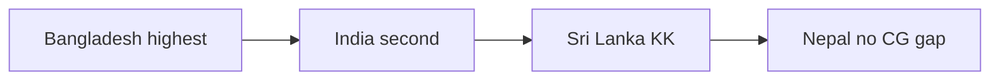
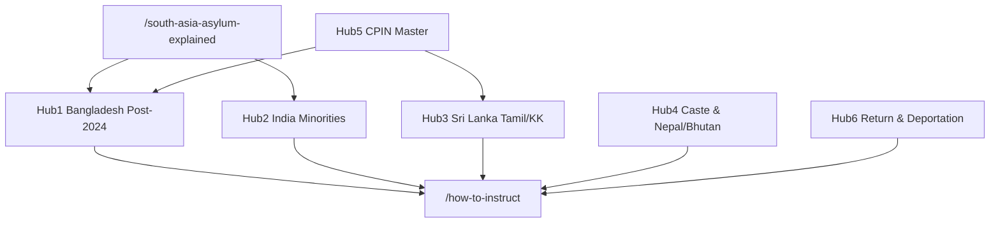

# SEO Architecture — southasiareports.com

**Canonical domain:** `https://www.southasiareports.com`  
**Site name:** SouthAsiaReports  
**Locale:** `en_GB` (UK immigration solicitors, law firms, Legal Aid practitioners)

This document is the single source of truth for keyword strategy, country-level keyword clusters, unique content assets, content clusters, internal linking, GEO (Generative Engine Optimization), two-domain redirect strategy, off-page SEO, schema architecture, and launch deployment for southasiareports.com. All slugs and URLs align with the canonical build-spec naming convention.

**Pakistan exclusion:** Pakistan asylum claims are covered separately at [pakistanexpertreports.com](https://www.pakistanexpertreports.com). This site covers Bangladesh, India, Sri Lanka, Nepal, and Bhutan only. Cross-link to pakistanexpertreports.com where relevant; do not publish Pakistan content on this domain.

**Implementation status:** Target architecture (June 2026). The repository is not yet bootstrapped. Once the Next.js app is built, canonical slugs, internal linking matrix (`data/related-links.ts`), GEO artifacts, schema, sitemap inventory (`lib/seo/publicUrlInventory.ts`), and 301 redirects (`lib/seo/slug-redirects.ts`, `middleware.ts`) must align with this document. Run `npm run seo:generate && npm run seo:verify` after SEO or route changes.

**Related files (future):** `data/asylum-profiles.ts`, `data/countries.ts`, `data/guides.ts`, `data/case-types.ts`, `data/glossary.ts`, `data/services.ts`, `data/cpin-data.ts`, `data/profile-geo.ts`, `data/related-links.ts`, `lib/metadata.ts`, `lib/schema.ts`, `lib/constants.ts`, `lib/glossary-links.ts`, `lib/seo/publicUrlInventory.ts`, `lib/seo/architecture-verify.ts`, `scripts/generate-seo.ts`, `scripts/verify-seo.ts`, `middleware.ts`

---

## 1. Keyword Strategy

### Tier 1 — Transactional

**Target pages:** homepage, services, asylum profiles, qualifications, case types, contact.

| Keyword | Primary URL |
|---------|-------------|
| South Asia expert reports UK | `/`, `/what-is-a-south-asia-expert-report` |
| Bangladesh country expert report UK | `/countries/bangladesh`, `/services/bangladesh-country-reports` |
| India asylum expert report UK | `/countries/india`, `/services/india-country-reports` |
| Sri Lanka expert report UK asylum | `/countries/sri-lanka`, `/services/sri-lanka-country-reports` |
| Bangladesh asylum expert report | `/countries/bangladesh`, `/services/bangladesh-post-2024-reports` |
| India country condition report UK | `/countries/india`, `/services/india-country-reports` |
| Nepal expert report UK asylum | `/countries/nepal`, `/services/nepal-bhutan-country-reports` |
| South Asia country condition report UK | `/south-asia-asylum-explained`, `/services` |
| Bangladesh political persecution expert report UK | `/asylum-profiles/political-persecution-south-asia`, `/case-types/bangladesh-political-claims` |
| Sri Lanka Tamil expert report UK | `/countries/sri-lanka`, `/case-types/sri-lanka-tamil-claims` |
| Legal Aid South Asia expert report UK | `/how-to-instruct`, `/guides/instructing-south-asia-expert` |

### Tier 2 — Informational

**Target pages:** pillar page, CPIN hub, guides, asylum profiles, countries, glossary.

| Keyword | Primary URL |
|---------|-------------|
| Bangladesh asylum 2024 political change expert report | `/guides/bangladesh-asylum-2024-guide`, `/countries/bangladesh` |
| Bangladesh BNP Awami League asylum UK 2025 report | `/asylum-profiles/political-persecution-south-asia`, `/guides/bangladesh-asylum-2024-guide` |
| India Muslim Hindutva expert report UK | `/asylum-profiles/religious-minority-persecution`, `/guides/india-asylum-guide` |
| Sri Lanka KK country guidance 2021 expert report | `/guides/sri-lanka-kk-guide`, `/glossary#kk-and-others-2021` |
| Nepal asylum expert report UK no country guidance | `/countries/nepal`, `/guides/nepal-bhutan-expert-guide`, `/how-to-instruct` |
| India asylum internal relocation expert report | `/services/internal-relocation-analysis`, `/countries/india` |
| Bangladesh Hindu minority expert report UK | `/asylum-profiles/religious-minority-persecution`, `/countries/bangladesh` |
| India LGBTQ+ asylum expert report post-2018 | `/asylum-profiles/lgbtq-south-asia`, `/countries/india` |
| Sri Lanka Tamil diaspora expert report UK | `/asylum-profiles/diaspora-activity-risk-on-return`, `/countries/sri-lanka` |
| What is a country condition report South Asia asylum | `/what-is-a-south-asia-expert-report`, `/south-asia-asylum-explained` |

### Tier 3 — Long-tail

**Target pages:** asylum profiles, guides, case types, countries, services, glossary.

| Keyword | Primary URL(s) |
|---------|----------------|
| Bangladesh BNP political persecution expert report UK 2025 | `/asylum-profiles/political-persecution-south-asia`, `/services/bangladesh-post-2024-reports`, `/glossary#bnp` |
| India Muslim Hindutva RSS expert report UK | `/glossary#hindutva`, `/glossary#rss`, `/asylum-profiles/religious-minority-persecution` |
| Sri Lanka Tamil LTTE association expert report UK | `/case-types/sri-lanka-tamil-claims`, `/glossary#ltte` |
| Nepal Dalit caste discrimination expert report UK | `/countries/nepal`, `/glossary#dalit`, `/asylum-profiles/caste-discrimination` |
| Bangladesh Hindu minority asylum expert report | `/asylum-profiles/religious-minority-persecution`, `/countries/bangladesh` |
| India Sikh asylum expert report UK | `/countries/india`, `/glossary#khalistan`, `/asylum-profiles/religious-minority-persecution` |
| Bangladesh August 2024 transition expert report | `/services/bangladesh-post-2024-reports`, `/guides/bangladesh-asylum-2024-guide` |
| India internal relocation Hindutva expert report | `/services/internal-relocation-analysis`, `/guides/india-asylum-guide` |
| Nepal Maoist asylum expert report UK | `/countries/nepal`, `/glossary#maoist-nepal`, `/guides/nepal-bhutan-expert-guide` |
| Bhutan Lhotshampa expert report UK | `/countries/bhutan`, `/glossary#lhotshampa` |
| South Asia CPIN challenge expert report solicitor | `/cpin-country-guidance`, `/services/cpin-challenge-reports`, `/case-types/upper-tribunal-south-asia` |
| Post-August 2024 Bangladesh country condition report UK | `/services/bangladesh-post-2024-reports`, `/countries/bangladesh` |

### Keyword → URL implementation reference

| Cluster | URL pattern | Meta source |
|---------|-------------|-------------|
| Brand / transactional | `/` | Page-level `createMetadata()` |
| Asylum profile transactional | `/asylum-profiles/{slug}` | `metaTitle`, `metaDescription`, `h1` in `data/asylum-profiles.ts` |
| Pillar / informational | `/south-asia-asylum-explained` | Page-level metadata + Article schema |
| CPIN pillar / informational | `/cpin-country-guidance` | Page-level metadata + `data/cpin-data.ts` |
| Country informational | `/countries/{slug}` | `data/countries.ts` |
| Case-type transactional | `/case-types/{slug}` | `data/case-types.ts` |
| Informational guides | `/guides/{slug}` | `data/guides.ts` |
| Utility / process | `/how-to-instruct`, `/qualifications` | Page-level metadata |
| Services | `/services`, `/services/{id}` | `data/services.ts` |
| Featured snippet / GEO | `/what-is-a-south-asia-expert-report` | Page-level metadata + checklist GEO block |

**Route note:** `/what-is-a-south-asia-expert-report` is the canonical GEO target and featured-snippet URL. Legacy `/what-is-a-south-asia-expert-witness` 301-redirects to it (see Section 6).

---

## 2. Country-Level Keyword Clusters

Country clusters are ordered by SEO priority. Bangladesh post-August 2024 content is uniquely timely — no competitor has dedicated current content in the South Asian asylum market.



### Bangladesh — highest priority

Post-August 2024 political transition content is the primary commissioning driver. Target URLs:

| Role | URL |
|------|-----|
| Country hub | `/countries/bangladesh` |
| Post-2024 service | `/services/bangladesh-post-2024-reports` |
| Country reports service | `/services/bangladesh-country-reports` |
| Transition guide | `/guides/bangladesh-asylum-2024-guide` |
| Political persecution profile | `/asylum-profiles/political-persecution-south-asia` (Bangladesh section) |
| CPIN section | `/cpin-country-guidance` (Bangladesh section) |

### India — second priority

Growing claim volume across religious minority, Hindutva, LGBTQ+, and internal relocation cases. Target URLs:

| Role | URL |
|------|-----|
| Country hub | `/countries/india` |
| Country reports service | `/services/india-country-reports` |
| Asylum guide | `/guides/india-asylum-guide` |
| Religious minority profile | `/asylum-profiles/religious-minority-persecution` |
| Internal relocation service | `/services/internal-relocation-analysis` |

### Sri Lanka — KK content

KK [2021] country guidance framework is the primary informational anchor. Target URLs:

| Role | URL |
|------|-----|
| Country hub | `/countries/sri-lanka` |
| Country reports service | `/services/sri-lanka-country-reports` |
| KK framework guide | `/guides/sri-lanka-kk-guide` |
| Tamil claims case type | `/case-types/sri-lanka-tamil-claims` |

### Nepal — no country guidance gap

Nepal has no UK country guidance — expert reports fill a documented evidence gap. Target URLs:

| Role | URL |
|------|-----|
| Country hub | `/countries/nepal` |
| Nepal/Bhutan service | `/services/nepal-bhutan-country-reports` |
| Expert guide | `/guides/nepal-bhutan-expert-guide` |
| No-CG FAQ | `/how-to-instruct` (Nepal no country guidance FAQ section) |

---

## 3. Unique Content Assets

Seven competitive differentiators that distinguish southasiareports.com from generic country-expert directories and from southasiaexpert.com (hash-only service anchors).

| # | Asset | URL(s) | Status |
|---|-------|--------|--------|
| 1 | Post-August 2024 Bangladesh expert report service page — most timely commissioning content in the South Asian asylum market | `/services/bangladesh-post-2024-reports` | Target |
| 2 | What is a South Asia expert report — featured snippet target with report checklist GEO asset | `/what-is-a-south-asia-expert-report` | Target |
| 3 | Eight dedicated `/services/[id]` commissioning pages — distinct keyword coverage from southasiaexpert.com hash anchors | `/services/{id}` (8 pages) | Target |
| 4 | Five-country comparison table — asylum landscape overview | `/south-asia-asylum-explained` | Target |
| 5 | KK Sri Lanka framework guide — KK [2021] analysis and summary table | `/guides/sri-lanka-kk-guide` | Target |
| 6 | India LGBTQ+ post-decriminalisation expert report analysis | `/asylum-profiles/lgbtq-south-asia`, `/countries/india` | Target |
| 7 | Nepal asylum without country guidance — unique educational value for solicitors | `/guides/nepal-bhutan-expert-guide`, `/how-to-instruct`, `/south-asia-asylum-explained` | Target |

---

## 4. GEO Targets

Eight extractable content blocks designed for AI citation and featured snippets. Each becomes a structured table, checklist, or summary block on the target page.

| # | GEO asset | Target URL |
|---|-----------|------------|
| 1 | Five-country comparison table (Bangladesh, India, Sri Lanka, Nepal, Bhutan) | `/south-asia-asylum-explained` |
| 2 | Bangladesh 2024 political transition analysis | `/services/bangladesh-post-2024-reports`, `/guides/bangladesh-asylum-2024-guide` |
| 3 | KK Sri Lanka summary table | `/guides/sri-lanka-kk-guide` |
| 4 | India Hindutva/Muslim persecution analysis | `/asylum-profiles/religious-minority-persecution`, `/guides/india-asylum-guide` |
| 5 | South Asia CPIN coverage table | `/cpin-country-guidance` |
| 6 | What a South Asia expert report should contain — checklist | `/what-is-a-south-asia-expert-report` |
| 7 | Post-August 2024 Bangladesh report commissioning guide | `/services/bangladesh-post-2024-reports` |
| 8 | Expert reports without country guidance — Nepal/Bangladesh/India | `/south-asia-asylum-explained` |

**Implementation:** GEO blocks live in page content and `data/profile-geo.ts`. Use semantic HTML (`<table>`, `<dl>`, ordered lists) for machine-readable extraction. Avoid rendering critical GEO content only in client-side JavaScript.

---

## 5. Two-Domain Strategy

`southasiaexpert.com` 301 redirects to `southasiareports.com`. This passes link equity from the "expert witness" keyword variant and captures both search intents without content duplication. Canonical URLs always point to `southasiareports.com` only.

| Domain | Role |
|--------|------|
| `www.southasiareports.com` | **Canonical host** (all content lives here) |
| `southasiareports.com` (apex) | **301 →** `https://www.southasiareports.com` |
| `southasiaexpert.com` | **Redirect domain** (301 to primary) |
| `www.southasiaexpert.com` | **Redirect domain** (301 to primary) |

**Rationale:** Solicitors search for both "South Asia expert reports" and "South Asia expert witness". A single site on the primary domain with 301 redirects from the legacy domain passes link equity and avoids duplicate content penalties.

**Cross-network:** Pakistan reports are served at [pakistanexpertreports.com](https://www.pakistanexpertreports.com). Link from footer or relevant hub pages only — no Pakistan content on this site.

**Implementation targets:**

1. **Vercel:** Add all four domains to the same project.
2. **`middleware.ts`:** Host checks for apex and legacy domains → `https://www.southasiareports.com` (301).
3. **Canonicals:** All `createMetadata()` canonical URLs, sitemap entries, and schema `@id` values use `https://www.southasiareports.com` only.
4. **No separate site** on `southasiaexpert.com`.

**Target middleware pattern:**

```ts
const PRIMARY_HOST = "www.southasiareports.com";
const PRIMARY_ORIGIN = `https://${PRIMARY_HOST}`;

const REDIRECT_HOSTS = new Set([
  "southasiareports.com",
  "southasiaexpert.com",
  "www.southasiaexpert.com",
]);
```

---

## 6. Content Clusters

Six topical hubs drive internal linking, anchor text, and content depth. Hub 1 (Bangladesh Post-2024) is highest priority. Cross-hub instruction pages connect all hubs to the commissioning funnel.



### Hub 1: Bangladesh Post-2024 (highest priority)

| Role | URL |
|------|-----|
| Country | `/countries/bangladesh` |
| Post-2024 service | `/services/bangladesh-post-2024-reports` |
| Country reports service | `/services/bangladesh-country-reports` |
| Guide | `/guides/bangladesh-asylum-2024-guide` |
| Profile | `/asylum-profiles/political-persecution-south-asia` |
| Case type | `/case-types/bangladesh-political-claims` |
| CPIN section | `/cpin-country-guidance` (Bangladesh section) |

### Hub 2: India Minorities

| Role | URL |
|------|-----|
| Country | `/countries/india` |
| Service | `/services/india-country-reports` |
| Internal relocation | `/services/internal-relocation-analysis` |
| Profile | `/asylum-profiles/religious-minority-persecution` |
| LGBTQ+ profile | `/asylum-profiles/lgbtq-south-asia` |
| Guide | `/guides/india-asylum-guide` |
| Case type | `/case-types/india-minority-claims` |

### Hub 3: Sri Lanka Tamil/KK

| Role | URL |
|------|-----|
| Country | `/countries/sri-lanka` |
| Service | `/services/sri-lanka-country-reports` |
| Guide | `/guides/sri-lanka-kk-guide` |
| Case type | `/case-types/sri-lanka-tamil-claims` |
| Profile | `/asylum-profiles/diaspora-activity-risk-on-return` |
| Glossary | `/glossary#kk-and-others-2021`, `/glossary#ltte` |

### Hub 4: Caste & Nepal/Bhutan

| Role | URL |
|------|-----|
| Countries | `/countries/nepal`, `/countries/bhutan` |
| Service | `/services/nepal-bhutan-country-reports` |
| Profile | `/asylum-profiles/caste-discrimination` |
| Guide | `/guides/nepal-bhutan-expert-guide` |
| Glossary | `/glossary#dalit`, `/glossary#lhotshampa`, `/glossary#caste` |

### Hub 5: CPIN Master

| Role | URL |
|------|-----|
| Pillar | `/cpin-country-guidance` |
| CPIN challenge service | `/services/cpin-challenge-reports` |
| CPIN guide | `/guides/south-asia-cpin-guide` |
| All countries | `/countries/{slug}` (5 pages) |
| Upper Tribunal case type | `/case-types/upper-tribunal-south-asia` |

### Hub 6: Return & Deportation

| Role | URL |
|------|-----|
| Profile | `/asylum-profiles/failed-asylum-seekers-return` |
| Case type — deportation | `/case-types/deportation-return-south-asia` |
| Case type — certification | `/case-types/certification-challenge` |

### Cross-hub instruction (all hubs)

| Role | URL |
|------|-----|
| Process | `/how-to-instruct` |
| Credentials | `/qualifications` |
| Expert report explainer | `/what-is-a-south-asia-expert-report` |
| Contact | `/contact` |
| Solicitor guide | `/guides/instructing-south-asia-expert` |

### Slug inventory

**Countries (5):**

`bangladesh`, `india`, `sri-lanka`, `nepal`, `bhutan`

**Services (8):**

`bangladesh-country-reports`, `india-country-reports`, `sri-lanka-country-reports`, `nepal-bhutan-country-reports`, `cpin-challenge-reports`, `internal-relocation-analysis`, `bangladesh-post-2024-reports`, `oral-evidence-tribunal`

**Asylum profiles (8):**

`political-persecution-south-asia`, `religious-minority-persecution`, `lgbtq-south-asia`, `caste-discrimination`, `women-gender-based-violence`, `journalists-human-rights-defenders`, `diaspora-activity-risk-on-return`, `failed-asylum-seekers-return`

**Case types (8):**

`ftt-south-asia-appeal`, `upper-tribunal-south-asia`, `sri-lanka-tamil-claims`, `bangladesh-political-claims`, `india-minority-claims`, `deportation-return-south-asia`, `fresh-claims-south-asia`, `certification-challenge`

**Guides (6):**

`bangladesh-asylum-2024-guide`, `india-asylum-guide`, `sri-lanka-kk-guide`, `south-asia-cpin-guide`, `nepal-bhutan-expert-guide`, `instructing-south-asia-expert`

### Legacy slug redirects (301)

| From | To |
|------|-----|
| `/what-is-a-south-asia-expert-witness` | `/what-is-a-south-asia-expert-report` |
| `/fees` | `/how-to-instruct` |
| `/faq` | `/guides` |
| `/experts` | `/qualifications` |

Implement in `lib/seo/slug-redirects.ts` and `middleware.ts`.

### Glossary anchor ID convention

Generate fragment IDs from term slug in `data/glossary.ts`:

```js
slug // e.g. "kk-and-others-2021" → /glossary#kk-and-others-2021
```

**SEO-critical anchor mappings:**

| Cluster reference | Glossary slug | Canonical anchor |
|-------------------|---------------|------------------|
| `#bnp` | bnp | `/glossary#bnp` |
| `#awami-league` | awami-league | `/glossary#awami-league` |
| `#hindutva` | hindutva | `/glossary#hindutva` |
| `#rss` | rss | `/glossary#rss` |
| `#kk-and-others-2021` | kk-and-others-2021 | `/glossary#kk-and-others-2021` |
| `#ltte` | ltte | `/glossary#ltte` |
| `#dalit` | dalit | `/glossary#dalit` |
| `#lhotshampa` | lhotshampa | `/glossary#lhotshampa` |
| `#maoist-nepal` | maoist-nepal | `/glossary#maoist-nepal` |
| `#cpin` | cpin | `/glossary#cpin` |
| `#khalistan` | khalistan | `/glossary#khalistan` |
| `#navtej-singh-johar` | navtej-singh-johar | `/glossary#navtej-singh-johar` |

---

## 7. Internal Linking Rules

### Rule A — Every `/asylum-profiles/[slug]` must link to:

- Relevant `/countries/[country]`
- Relevant `/services/[id]`
- `/cpin-country-guidance`
- `/how-to-instruct`
- `/contact`

### Rule B — Every `/countries/[slug]` must link to:

- Relevant `/services/[id]`
- Relevant `/asylum-profiles/[slug]`
- `/cpin-country-guidance`
- Relevant `/guides/[slug]`

### Rule C — Every `/services/[id]` must link to:

- Relevant `/asylum-profiles/[slug]`
- `/how-to-instruct`
- `/qualifications`

### Rule D — `/cpin-country-guidance` must link to:

- All five `/countries/[slug]` pages
- `/services/cpin-challenge-reports`

### Rule E — Homepage must link to:

- Top 3 country pages: Bangladesh, India, Sri Lanka
- `/services/bangladesh-post-2024-reports`
- `/south-asia-asylum-explained`
- `/what-is-a-south-asia-expert-report`

### Additional recommended rules

#### Every `/guides/[slug]` must link to:

- Relevant `/asylum-profiles/[slug]` page(s)
- Relevant `/countries/[slug]` and/or `/services/[id]` where applicable
- `/cpin-country-guidance` or `/south-asia-asylum-explained`
- `/how-to-instruct`
- `/contact`

#### Every `/case-types/[slug]` must link to:

- Relevant `/asylum-profiles/[slug]` page(s)
- Relevant `/services/[id]` where applicable
- `/how-to-instruct`
- `/contact`

#### Glossary terms must link to:

- Most relevant `/asylum-profiles/[slug]`
- Most relevant `/guides/[slug]` or `/countries/[slug]`
- `/cpin-country-guidance` or `/south-asia-asylum-explained` where applicable

**Enforcement:** Populate `relatedLinks` in `data/related-links.ts`. Implement `getProfileRelatedLinks()`, `getCountryRelatedLinks()`, `getServiceRelatedLinks()`, `getGuideRelatedLinks()`, and `getCaseTypeRelatedLinks()`. Render via the shared `RelatedLinks` component. Verify with `lib/seo/architecture-verify.ts` in `npm run seo:verify`. Use descriptive anchor text (e.g. "Post-August 2024 Bangladesh expert reports" not "click here").

**Cross-linking priority:** Hub pillar → country/service → profile/guide → instruction → contact.

See [Appendix D](#appendix-d-profile-minimum-links-matrix) for the profile minimum links matrix.

---

## 8. Off-Page SEO

### Directory and professional listings

- **EIN directory** — list southasiareports.com as South Asia expert reports provider
- **ILPA** (Immigration Law Practitioners' Association)
- **Free Movement** — practitioner resource cross-reference where appropriate

### Institutional and NGO partners (potential linking)

- **SOAS South Asia Institute** — academic credibility and referral traffic
- **Bail for Immigration Detainees (BID)** — detention and return-risk cases

### Cross-network links

- [pakistanexpertreports.com](https://www.pakistanexpertreports.com) — Pakistan expert reports (footer/network link only)
- Persecution-expert network — cross-link where applicable across specialist country-report sites

### Social

- **LinkedIn:** SouthAsiaReports — publish commissioning guides and Bangladesh transition updates

---

## 9. Deployment Checklist

### DNS and hosting

- [ ] Vercel project configured for `southasiareports.com` and `southasiaexpert.com`
- [ ] DNS: `southasiareports.com` apex → Vercel; `www` CNAME → Vercel
- [ ] DNS: `southasiaexpert.com` and `www.southasiaexpert.com` → same Vercel project

### Redirects

- [ ] Apex `southasiareports.com` → `https://www.southasiareports.com` (301)
- [ ] `southasiaexpert.com` → `https://www.southasiareports.com` (301)
- [ ] `www.southasiaexpert.com` → `https://www.southasiareports.com` (301)
- [ ] Legacy slug redirects in `lib/seo/slug-redirects.ts` (Section 6)

### Technical SEO

- [ ] `hreflang`: `en-GB`, `en-US`, `x-default` in root layout metadata
- [ ] `html lang="en-GB"` on root layout
- [ ] All env vars set (`SITE_URL=https://www.southasiareports.com`, analytics, contact form)
- [ ] `public/robots.txt` and `public/sitemap.xml` generated at build time
- [ ] Google Search Console verification tag
- [ ] Bing Webmaster Tools verification tag

### Post-launch

- [ ] LinkedIn page: SouthAsiaReports
- [ ] EIN directory submission
- [ ] ILPA submission
- [ ] GSC sitemap submit: `https://www.southasiareports.com/sitemap.xml`
- [ ] Bing sitemap submit

### CI verification

```bash
npm run seo:generate && npm run seo:verify
```

Run on every deploy and in CI (`.github/workflows/seo-checks.yml`).

---

## 10. Sitemap Priorities

Priorities are enforced in `lib/seo/publicUrlInventory.ts` and written to `public/sitemap.xml` by `scripts/generate-seo.ts`.

| Route | Priority |
|-------|----------|
| `/` | 1.0 |
| `/south-asia-asylum-explained` | 0.95 |
| `/cpin-country-guidance` | 0.95 |
| `/countries` | 0.95 |
| `/countries/bangladesh` | 0.94 |
| `/countries/india` | 0.94 |
| `/services/bangladesh-post-2024-reports` | 0.94 |
| `/countries/sri-lanka` | 0.93 |
| `/asylum-profiles` | 0.93 |
| `/asylum-profiles/[slug]` | 0.92 |
| `/countries/nepal` | 0.92 |
| `/countries/bhutan` | 0.90 |
| `/services` | 0.90 |
| `/services/[id]` | 0.90 |
| `/what-is-a-south-asia-expert-report` | 0.90 |
| `/case-types/[slug]` | 0.88 |
| `/how-to-instruct` | 0.88 |
| `/qualifications` | 0.88 |
| `/guides/[slug]` | 0.82 |
| `/glossary` | 0.75 |

### Excluded from sitemap

| URL | Robots |
|-----|--------|
| `/contact` | excluded from sitemap |
| `/privacy` | noindex, follow |
| `/terms` | noindex, follow |
| `/cookie-policy` | noindex, follow |
| `/thank-you` | noindex, nofollow |

**Total indexable URLs:** 48 (1 homepage + 11 static + 5 countries + 8 services + 8 profiles + 8 case types + 6 guides + 1 glossary hub).

---

## Appendix A: Full Route Inventory

### Static pages (11)

| URL | Priority | Index |
|-----|----------|-------|
| `/` | 1.0 | yes |
| `/south-asia-asylum-explained` | 0.95 | yes |
| `/cpin-country-guidance` | 0.95 | yes |
| `/countries` | 0.95 | yes |
| `/asylum-profiles` | 0.93 | yes |
| `/services` | 0.90 | yes |
| `/what-is-a-south-asia-expert-report` | 0.90 | yes |
| `/case-types` | 0.88 | yes |
| `/how-to-instruct` | 0.88 | yes |
| `/qualifications` | 0.88 | yes |
| `/guides` | 0.82 | yes |
| `/glossary` | 0.75 | yes |

### Dynamic pages (37)

| Pattern | Count | Priority |
|---------|-------|----------|
| `/countries/[slug]` | 5 | 0.90–0.94 |
| `/services/[id]` | 8 | 0.90 (0.94 for `bangladesh-post-2024-reports`) |
| `/asylum-profiles/[slug]` | 8 | 0.92 |
| `/case-types/[slug]` | 8 | 0.88 |
| `/guides/[slug]` | 6 | 0.82 |

### Utility / legal (noindex or excluded)

| URL | Notes |
|-----|-------|
| `/contact` | excluded from sitemap |
| `/thank-you` | noindex, nofollow |
| `/privacy`, `/terms`, `/cookie-policy` | noindex, follow |
| `app/not-found.tsx` | Custom 404 |

### Removed routes (301 redirects)

| From | To |
|------|-----|
| `/fees` | `/how-to-instruct` |
| `/faq` | `/guides` |
| `/experts` | `/qualifications` |
| `/what-is-a-south-asia-expert-witness` | `/what-is-a-south-asia-expert-report` |

---

## Appendix B: Schema Architecture Summary

### Root entity

```json
{
  "@type": "Organization",
  "@id": "https://www.southasiareports.com/#organization"
}
```

### Children of Organization

| Type | Count | URL / @id | Notes |
|------|-------|-----------|-------|
| ProfessionalService | 1 | `/` — `#professional-service` | Homepage |
| Service | 8 | `/services/{id}` | Dedicated service pages |
| Article | 1 | `/south-asia-asylum-explained` | Pillar page |
| Article | 1 | `/cpin-country-guidance` | CPIN hub |
| Article | 6 | `/guides/{slug}` | Guide pages |
| FAQPage | 24+ | Dynamic routes with FAQs | Profiles, case types, countries |
| BreadcrumbList | All non-home | Per-page | |
| WebSite | 1 | `/` | SearchAction optional |

### Page → schema template matrix

| Route | JSON-LD types |
|-------|---------------|
| `/` | Organization, ProfessionalService |
| `/services` | Organization, Service ×8 (ItemList) |
| `/services/[id]` | Organization, Service, BreadcrumbList |
| `/south-asia-asylum-explained` | Organization, Article, BreadcrumbList |
| `/what-is-a-south-asia-expert-report` | Organization, Article, FAQPage, BreadcrumbList |
| `/cpin-country-guidance` | Organization, Article, BreadcrumbList, FAQPage |
| `/guides/[slug]` | Organization, Article, BreadcrumbList |
| `/asylum-profiles/[slug]` | Organization, BreadcrumbList, FAQPage |
| `/countries/[slug]` | Organization, BreadcrumbList, FAQPage |
| `/case-types/[slug]` | Organization, BreadcrumbList, FAQPage |
| `/glossary` | Organization, BreadcrumbList |
| Static utility pages | Organization, BreadcrumbList |

---

## Appendix C: Recommended Build Order

1. Root layout (`lang="en-GB"`, hreflang), `createMetadata()`, `JsonLd`, Header/Footer
2. `middleware.ts` — apex + southasiaexpert.com 301 redirects
3. Data layer: `asylum-profiles.ts`, `countries.ts`, `case-types.ts`, `guides.ts`, `glossary.ts`, `services.ts`, `cpin-data.ts`
4. Dynamic routes: `/asylum-profiles/[slug]`, `/countries/[slug]`, `/case-types/[slug]`, `/guides/[slug]`, `/services/[slug]`
5. Static pages: `/south-asia-asylum-explained`, `/cpin-country-guidance`, `/what-is-a-south-asia-expert-report`, `/services`, `/how-to-instruct`, `/qualifications`, `/glossary`, `/contact`
6. Homepage with Rule E links (top 3 countries, post-2024 service, pillar pages)
7. `RelatedLinks` component + Appendix D matrix + `getServiceRelatedLinks()`
8. GEO tables on pillar, CPIN, service, and profile pages (Section 4)
9. `lib/seo/publicUrlInventory.ts`, `scripts/generate-seo.ts`, `scripts/verify-seo.ts`, `lib/seo/architecture-verify.ts`
10. `public/sitemap.xml`, `public/robots.txt` via `npm run seo:generate`; CI workflow
11. Post-launch: EIN and ILPA directory submissions, GSC/Bing sitemap submit, LinkedIn

**Bootstrap sources:**

- Content structure and profiles/countries/guides: `south-asia-expert` repo
- `/services/[slug]` pages and SEO verification stack: `pakistan-expert-reports` repo

---

## Appendix D: Profile Minimum Links Matrix

Minimum internal links per Rule A. Implement via `getProfileRelatedLinks()` in `data/related-links.ts`.

| Profile slug | Country | Service | CPIN / pillar | Case types | Guides |
|--------------|---------|---------|---------------|------------|--------|
| `political-persecution-south-asia` | `bangladesh` | `bangladesh-post-2024-reports` | `/cpin-country-guidance` | `bangladesh-political-claims` | `bangladesh-asylum-2024-guide` |
| `religious-minority-persecution` | `india`, `bangladesh` | `india-country-reports` | `/cpin-country-guidance` | `india-minority-claims` | `india-asylum-guide` |
| `lgbtq-south-asia` | `india` | `india-country-reports` | `/cpin-country-guidance` | `india-minority-claims` | `india-asylum-guide` |
| `caste-discrimination` | `india`, `nepal` | `nepal-bhutan-country-reports` | `/cpin-country-guidance` | `india-minority-claims` | `nepal-bhutan-expert-guide` |
| `women-gender-based-violence` | `bangladesh` | `bangladesh-country-reports` | `/south-asia-asylum-explained` | `ftt-south-asia-appeal` | — |
| `journalists-human-rights-defenders` | `bangladesh` | `bangladesh-post-2024-reports` | `/cpin-country-guidance` | `bangladesh-political-claims` | `bangladesh-asylum-2024-guide` |
| `diaspora-activity-risk-on-return` | `sri-lanka` | `sri-lanka-country-reports` | `/cpin-country-guidance` | `sri-lanka-tamil-claims` | `sri-lanka-kk-guide` |
| `failed-asylum-seekers-return` | — | `cpin-challenge-reports` | `/cpin-country-guidance` | `deportation-return-south-asia` | `south-asia-cpin-guide` |

**All asylum profile pages:** `/how-to-instruct`, `/contact`

### Service → profile links (Rule C)

| Service slug | Required profile links |
|--------------|------------------------|
| `bangladesh-post-2024-reports` | `political-persecution-south-asia`, `journalists-human-rights-defenders` |
| `bangladesh-country-reports` | `political-persecution-south-asia`, `women-gender-based-violence` |
| `india-country-reports` | `religious-minority-persecution`, `lgbtq-south-asia` |
| `sri-lanka-country-reports` | `diaspora-activity-risk-on-return` |
| `nepal-bhutan-country-reports` | `caste-discrimination` |
| `internal-relocation-analysis` | `religious-minority-persecution` |
| `cpin-challenge-reports` | `failed-asylum-seekers-return` |
| `oral-evidence-tribunal` | — (links to `/qualifications`, `/how-to-instruct`) |

### Guide → profile links

| Guide slug | Required profile links |
|------------|------------------------|
| `bangladesh-asylum-2024-guide` | `political-persecution-south-asia` |
| `india-asylum-guide` | `religious-minority-persecution`, `lgbtq-south-asia` |
| `sri-lanka-kk-guide` | `diaspora-activity-risk-on-return` |
| `south-asia-cpin-guide` | — (links to CPIN hub and countries) |
| `nepal-bhutan-expert-guide` | `caste-discrimination` |
| `instructing-south-asia-expert` | Top transactional profiles |

---

## Document control

| Version | Date | Notes |
|---------|------|-------|
| 1.0 | 2026-06-12 | Initial SEO architecture for southasiareports.com |
